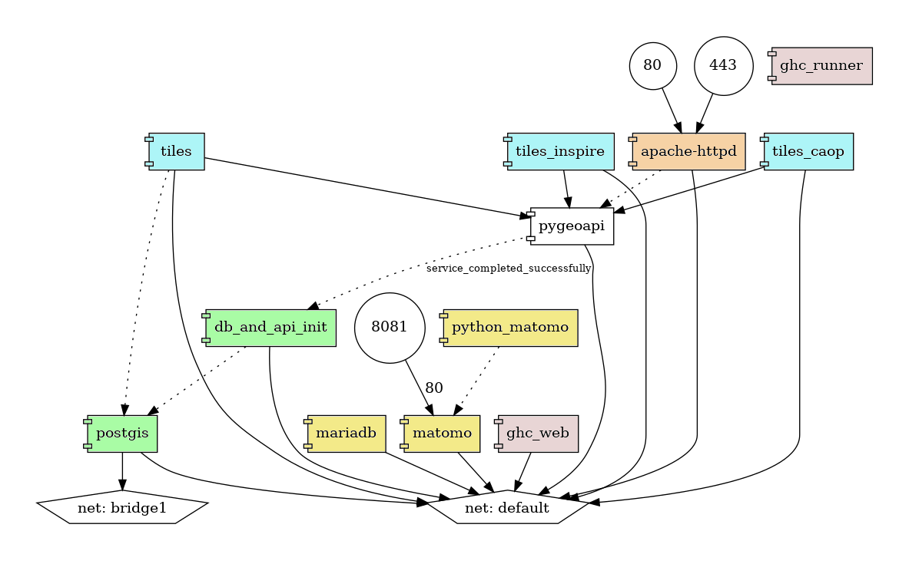
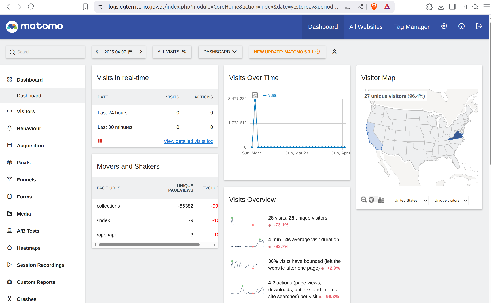
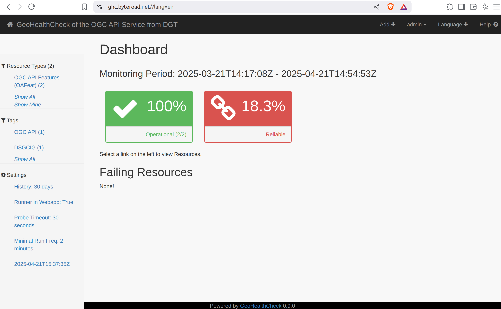

# Arquitectura do Sistema

A arquitectura do sistema, definida no [ficheiro de configuração do docker compose](https://github.com/byteroad/ogcapi-simple/blob/master/docker-compose.yml), articula os vários serviços que compõem a IDE. No centro, está a [pygeoapi](https://pygeoapi.io/), uma API de python que implementa vários Standards OGC API. Os serviços podem ser divididos em vários grupos:

* Base de dados geospacial.
* Serviços de Tiles.
* Serviços de monitorização de logs.
* Serviços que monitorizam outros serviços.

Os serviços expostos à Internet são publicados por um servidor de web ([apache](https://httpd.apache.org/)), que funciona como um proxy. É também este servidor que faz a gestão dos certificados SSL. Actualmente o servidor expõe três sub-domínios, que dão acesso a três serviços deste sistema:

* `ogcapi.dgterritorio.gov.pt` -> API com OGCAPI (pygeoapi).
* `logs.dgterritorio.gov.pt` -> monitorização de logs (matomo).
* `logs.dgterritorio.gov.pt` -> monitorização de serviços (GeoHealthCheck).

Mais detalhes sobre a configuração do apache podem ser encontrados [neste](https://github.com/byteroad/ogcapi-simple/blob/master/apache-httpd/httpd-ssl.conf) ficheiro.

Nos próximos parágrafos, os serviços são descritos com maior detalhe.

## Bases de dados geospacial

A Base de Dados (BD) utilizada para guardar os dados geospaciais está no serviço `postgis`. Na altura em que foi escrito este manual este serviço tem um servidor PostgreSQL 15.0 com PostGIS 3.5.2. Quando o sistema inicia, um serviço chamado `db_and_api_init` é responsável por carregar os dados, em formatos diversos como Shapefile ou GeoPackage, na directoria `\data`. Para além de pré-processar e carregar esses dados, este serviço também cria as vistas necessárias na BD, e os ficheiros de configuração para a pygeoapi. 

!!! info

    Nem todas as colecções publicadas pela pygeoapi se encontram guardadas nesta BD. Este sistema usa também alguns dados que estão guardados em BD externas (fora desta composição e fora desta máquina). Os endereços desses servidores, assim como outros parâmetros de conexão são injectados no [ficheiro de configuração da pygeoapi](https://github.com/byteroad/ogcapi-simple/blob/master/pygeoapi/docker.config.) através de variáveis ambientais. Essas variáveis ambientais estão descritas num ficheiro `.env`, que se encontra na raiz da directoria onde se encontra o ficheiro de docker compose.
    

## Serviços de Tiles

As tiles vectoriais são publicadas pela aplicação [martin](https://github.com/maplibre/martin), que permite servir estes dados directamente a partir de tabelas de PostGIS. Para acelerar a performance, usaram-se [Materialized Views](https://en.wikipedia.org/wiki/Materialized_view) no lugar de views, e criaram-se índices geospaciais e índices únicos para todas as vistas e tabelas. Como cada instância de martin fica assignada a uma BD, foram criadas três instâncias diferentes, assignadas a cada uma das BD usadas para guardar dados geospaciais:

* Serviço `tiles`: publica tiles a partir de tabelas na [base de dados geospacial](./arquitectura.md#bases-de-dados-geospacial).
* Serviço `tiles-inspire`: publica tiles a partir de uma tabela com o cadastro, na BD inspire (externa).
* Serviço `tiles-caop`: publica tiles a partir de tabelas na BD caop (externa).

!!! warning

    O martin lê as tabelas da BD quando inicia. Por esse motivo, se forem adicionadas novas tabelas na BD, o martin não irá publicar-las até que o servidor seja reiniciado.

## Serviços de Monitorização de Logs

Os logs do servidor web (e.g. Apache) são monitorizados usando o [matomo](https://matomo.org/), uma alternativa ao Google Analytics que protege os dados e a privacidade dos utilizadores. O serviço `matomo` corresponde á aplicação matomo, cujos dados são guardados no serviço de `mariadb`. Finalmente, o `python_matomo` é um serviço de suporte que faz a ingestão dos logs do Apache através de um cron job.

O matomo está configurado para monitorizar o website `ogcapi.dgterritorio.gov.pt`, apresentando uma dashboard com métricas como o número de visitantes ou os endpoints visitados, e ainda o mapa com a origem dos visitantes. A informação de como usar o matomo está disponível no [guia do utilizador](https://matomo.org/guide/getting-started/getting-started/).

!!! warning

    O python_matomo lê os logs do Apache, através de um volume partilhado entre os containers. No caso de se mudar este container para uma outra máquina, seria necessário assegurar que se continua a ter acesso aos logs do Apache (por exemplo através de uma directoria de rede montada).

!!! info

    Em príncipio os dados do matomo são persistidos na pasta `./matomo/data/matomo`, mesmo que containers e respectivos volumes sejam apagados. No caso de se migrar o servidor para outra máquina, é importante copiar essa directoria (tal como a BD), para que não se perca o histórico de logs do matomo.

## Serviços que Monitorizam outros Serviços

Os serviços OGC API, publicados pela pygeoapi são monitorizados usando o [GeoHealthCheck](https://geohealthcheck.org/)(GHC), um monitor de QoS (Quality of Service) para serviços geospaciais. O GHC é constituído pelo serviço de backend - `gc_runner` e a aplicação de web `ghc_web`. Os dados são persistidos numa BD [SQLite](https://sqlite.org/). Na altura de escrita deste manual, o GHC está configurado para monitorizar um endpoint de OGC API - Features, mas outros endpoints (incluindo serviços OWS) podem ser adicionados.

A informação sobre como configurar e usar o GHC está disponível na [documentação oficial do projeto](https://docs.geohealthcheck.org/en/latest/).

!!! tip

    Devido á configuração da rede, o container `ghc` não consegue aceder ao container `apache` pelo IP externo. Para ultrapassar esse problema, pode-se associar o IP de intranet do apache ao DNS, no ficheiro `/etc/localhosts`. Estes são os passos para executar essa acção, a partir da máquina onde está a correr a composição de docker:

    * Entrar no container `ghc_web`: `docker exec -it ghc_web bash`
    * Instalar o ping (iputils-ping) e o nano: `apt-get update && apt-get install iputils-ping nano -y`
    * Fazer ping container do apache para obter o seu endereço de IP na intranet: `ping httpd`
    * Adicionar este IP ao ficheiro /etc/hosts, fazendo-o apontar para `ogcapi.dgterritorio.gov.pt`: `echo "172.19.0.12 ogcapi.dgterritorio.gov.pt" >> /etc/hosts` (*substituir 172.19.0.12 pelo IP identificado no passo anterior!*)
    * Confirmar que o ping para `ogcapi.dgterritorio.gov.pt` retorna o IP de intranet do Apache: `ping ogcapi.dgterritorio.gov.pt`. Em caso afirmativo, não é preciso fazer mais nada.
  
    **Será necessário executar estes passos, de cada vez que houver um restart do servidor!**
