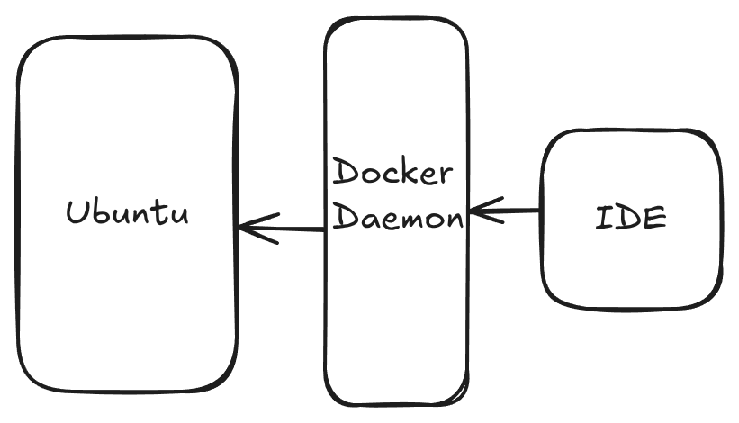

# Tecnologias

Este sistema foi desenvolvido com recurso a tecnologias de software livre e de código aberto. 

O servidor é uma máquina de Linux, que à data de escrita deste manual tem o [Ubuntu 24.04.2 LTS (Noble)](https://releases.ubuntu.com/noble/) instalado. É recomendado adoptar releases LTS (Long Term Support) pela sua estabilidade, e também porque têm um suporte mais longo do que as versões Standard.

O servidor tem habilitado um servidor de [SSH (Secure shell)](https://en.wikipedia.org/wiki/Secure_Shell), que permite aceder de forma segura ao terminal e efectuar todas as operações descritas neste manual.

A Infra Estrutura de Dados (IDE) OGC API da DGT, de aqui em diante designada OGCAPI - DGT, está implementada utilizando máquinas virtuais (docker containers), que são orquestradas usando docker compose.

[Docker](https://docs.docker.com/get-started/docker-overview/) é uma plataforma para desenvolver, empacotar e correr aplicações. O Docker permite descrever a "infraestrutura como código", e desta forma assegurar a reproducibilidade do sistema. Isso permite abstrair de uma infraestrutura específica, possibilitando a instalação em servidores de cloud ou nativos de diferentes provedores.

O [docker compose](https://docs.docker.com/compose/) é uma ferramenta que permite gerir aplicações que envolvem vários containers de docker. Os serviços, volumes e redes podem ser descritos num único ficheiro de configuração, e todo o sistema pode ser iniciado, reiniciado ou terminado com comandos simples. No próximo capítulo é descrita a arquitectura da IDE, que está definida nos ficheiros de configuração do docker compose.